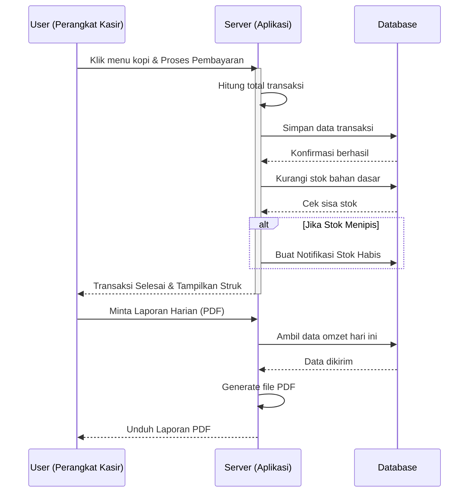
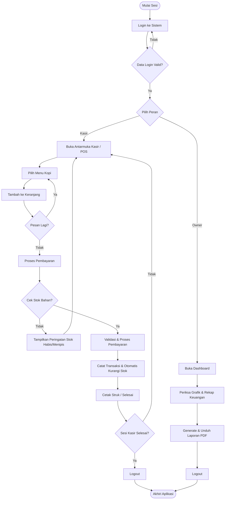
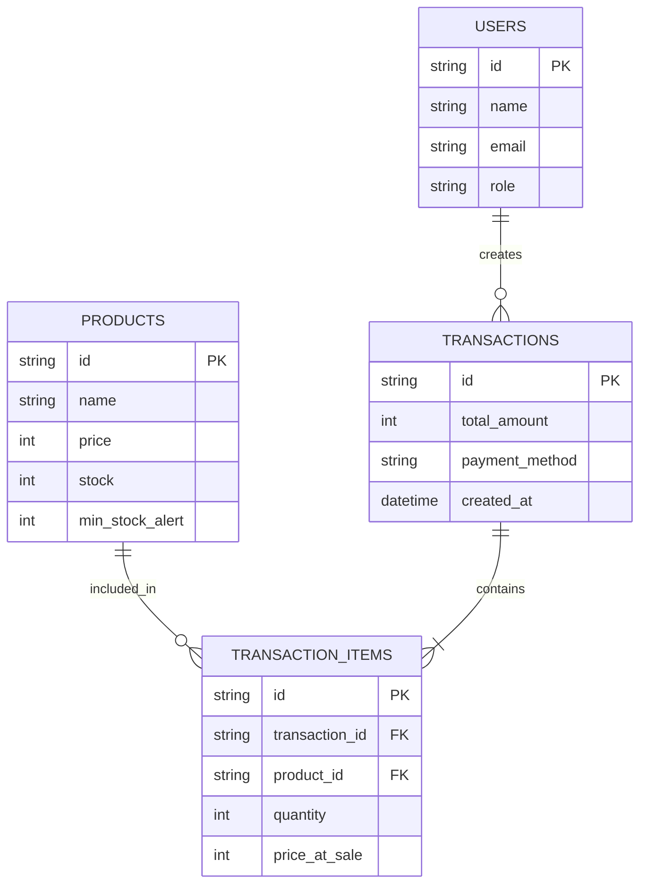

# PRD — Project Requirements Document

## 1. Overview
Banyak pemilik *Coffee Shop* saat ini masih menggunakan mesin kasir manual yang merepotkan dan tidak fleksibel. Aplikasi ini dibangun untuk menyelesaikan masalah tersebut dengan menyediakan sistem kasir (POS) modern berbasis *cloud* yang dapat diakses dari perangkat apa saja (laptop, tablet, atau *smartphone*). Tujuan utama aplikasi ini adalah mempercepat proses transaksi (jual kopi cepat), mencegah kehabisan bahan baku, serta mengotomatiskan pembukuan sehingga pemilik bisnis dapat melihat laporan keuangan harian yang jelas dan transparan.

## 2. Requirements
- **Aksesibilitas Multi-Perangkat:** Sistem harus berbasis *web-responsive* agar bisa dibuka dari perangkat apa pun tanpa perlu instalasi khusus.
- **Kecepatan Transaksi:** Antarmuka kasir harus meminimalkan jumlah klik agar pelayan bisa melayani pelanggan dengan sangat cepat saat *jam sibuk*.
- **Otomatisasi Data:** Setiap transaksi yang selesai harus secara otomatis memotong stok barang dan masuk ke dalam pembukuan keuangan.
- **Kemudahan Laporan (Clear Reports):** Sistem harus bisa mengubah data rumit menjadi laporan visual yang mudah dipahami dan siap dicetak ke format PDF.

## 3. Core Features
- **Tap-to-Sell POS:** Antifis kasir berupa tombol-tombol visual (gambar/nama menu kopi) yang bisa diklik untuk menambahkan pesanan ke keranjang pembayaran dengan cepat.
- **Dashboard & Pembukuan Otomatis:** Halaman utama untuk melihat ringkasan uang masuk, total penjualan harian, dan grafik pendapatan secara *real-time*.
- **Manajemen Inventaris & Notifikasi:** Fitur untuk memantau sisa stok barang (seperti biji kopi, susu, cup). Sistem akan memunculkan notifikasi atau peringatan ketika ada barang yang stoknya sudah menipis (mau habis).
- **Cetak Laporan PDF:** Tombol satu kali klik untuk mengunduh dan mencetak ringkasan laporan harian, mingguan, atau bulanan yang rapi dan jelas.

## 4. User Flow
1. **Login & Buka Kasir:** Kasir atau Pemilik login menggunakan kredensial mereka.
2. **Melakukan Penjualan:** 
   - Pelanggan memesan kopi.
   - Kasir menekan menu kopi pada layar (Tap-to-Sell).
   - Kasir memproses pembayaran dan menyelesaikan transaksi.
3. **Pembaruan Otomatis (Sistem bekerja di belakang layar):** 
   - Uang masuk dicatat otomatis ke pembukuan.
   - Stok kopi dan bahan lainnya otomatis berkurang.
   - *Jika stok menipis*, sistem mengirimkan notifikasi ke Dashboard.
4. **Melihat & Mencetak Laporan:** Pemilik membuka menu Dashboard pada penghujung hari, meninjau total pendapatan, lalu menekan tombol "Cetak PDF" untuk menyimpan laporan.

## 5. Architecture
Aplikasi ini menggunakan arsitektur aplikasi web modern (Client-Server). Pengguna (Kasir/Pemilik) mengakses aplikasi melalui peramban (browser) di perangkat mereka. Peramban akan berkomunikasi dengan Server yang memproses logika bisnis (menghitung uang, mengecek stok), dan Server akan menyimpan atau mengambil data dari Database.

**Diagram Alur Sistem (Sequence Diagram)**

**Flowchart Proses Bisnis**
Diagram berikut mendampingi Sequence Diagram untuk memperjelas alur logika sistem dari sudut pandang pengguna dan titik keputusan bisnis:

## 6. Database Schema
Berikut adalah tabel-tabel utama yang diperlukan untuk menjalankan sistem kasir ini:

1. **Users** (Menyimpan data pemilik dan kasir)
   - `id` (String/UUID): Pengenal unik pengguna
   - `name` (String): Nama pengguna
   - `email` (String): Email untuk login
   - `role` (String): Peran pengguna ('owner' atau 'cashier')

2. **Products** (Menyimpan data menu kopi dan inventaris)
   - `id` (String/UUID): Pengenal unik produk
   - `name` (String): Nama produk (ex: Kopi Susu Aren)
   - `price` (Integer): Harga jual produk
   - `stock` (Integer): Jumlah stok tersisa saat ini
   - `min_stock_alert` (Integer): Batas minimal stok sebelum notifikasi muncul

3. **Transactions** (Menyimpan data ringkasan satu kali pembayaran)
   - `id` (String/UUID): Nomor nota / struk
   - `total_amount` (Integer): Total uang yang dibayar
   - `payment_method` (String): Metode bayar (Cash, QRIS, dll)
   - `created_at` (Timestamp): Waktu transaksi terjadi

4. **Transaction_Items** (Menyimpan detail barang apa saja yang dibeli dalam satu transaksi)
   - `id` (String/UUID): Pengenal unik
   - `transaction_id` (String/UUID): Relasi ke tabel Transactions
   - `product_id` (String/UUID): Relasi ke tabel Products
   - `quantity` (Integer): Jumlah barang yang dibeli
   - `price_at_sale` (Integer): Harga satuan saat transaksi terjadi

## 7. Tech Stack
Berdasarkan kebutuhan kecepatan pengembangan, performa yang ringan, dan otomatisasi dari sisi teknis, berikut rekomendasi teknologi yang digunakan:

- **Frontend & Backend (Fullstack Framework):** TanStack Start — Framework full-stack modern yang menjamin keamanan tipe (type-safety) di seluruh lapisan kode dan menawarkan arsitektur routing serta server functions yang dioptimalkan untuk performa tinggi, sehingga mempercepat pengembangan tanpa mengorbankan skalabilitas.
- **Styling & UI Components:** Tailwind CSS & shadcn/ui — Digunakan untuk membangun antarmuka kasir yang modern dan responsif. Tema visual yang diterapkan adalah **"Amber minimal"** dari Tweakcn, yang dapat diakses dan diinstal secara langsung melalui registry resmi menggunakan perintah: `npx shadcn@latest add https://tweakcn.com/r/themes/amber-minimal.json`. Hal ini memastikan konsistensi estetika visual di seluruh aplikasi tanpa perlu konfigurasi manual yang rumit.
- **Database:** Supabase — Database cloud berbasis PostgreSQL yang andal, teresksekusi, dan mudah diskalakan. Sangat cocok untuk sistem kasir karena menyediakan sinkronisasi data real-time antar perangkat, keamanan tingkat enterprise, serta backend terkelola yang menjamin data bisnis tidak akan hilang meskipun perangkat kasir mengalami kerusakan atau kehilangan koneksi internet sementara.
- **ORM (Penghubung Database):** Drizzle ORM — Tetap digunakan untuk interaksi yang aman dan efisien dengan Supabase (PostgreSQL), memungkinkan penulisan query yang type-safe, mudah dipelihara, dan memberikan performa tinggi dalam pengelolaan transaksi dan inventaris.
- **Authentication:** Better Auth — Sistem keamanan login yang mudah diatur.
- **Library Tambahan:** `jspdf` atau `react-to-print` — Digunakan khusus untuk mengekspor halaman laporan keuangan langsung menjadi file PDF.
- **Deployment:** Vercel — Untuk meng-online-kan aplikasi secara gratis atau dengan biaya sangat murah dan sistem *auto-update*.